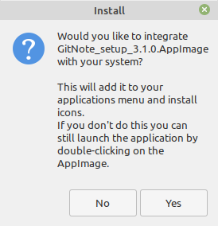
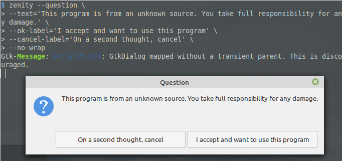

# AppImage is great

If you distro hop a lot then you know it can be pain to setup your workflow _again_ after a hype powered hop. It can be even more frustrating if packages you need are not available in local repo or require compiling. Compiling isn't really a bad thing or frustrating, but it can take long time. Let me introduce [drums ...] AppImage. This beauty has everyting in it and it is cross-distro.

**Fun Fact**: Apple have been using AppImage like technology for years. If you used a Mac PC\*, you probably downloaded `.dmg` (disk image) files to install programs which are not available on App Store. Programs in `.dmg` can be run without installing. Installing them is as simple as moving them to Applications directory.

\* Macs are personal computers, change my mind.

AppImages are awesome but not perfect:

> #### No installation
> 
> > **Pro** They are portable and don't need root priviledges to install
> 
> > **Con** They are archieves that may take few seconds to extract

> #### Ship with their dependencies
> 
> > **Pro** No update breaks AppImage dependency
> > 
> > _except updates to [fuse](https://en.wikipedia.org/wiki/Filesystem_in_Userspace "Filesystem in Userspace") or kernel_
> 
> > **Con** They usualy are larger than normal installation from local repo

> #### Read only
> 
> > **Pro** No virus or malware can enter from outside
> 
> > **Con** Any changes to settings and such are stored in `$USER` profile, not in AppImage

> ##### Honorable mentions
> 
> > **Pro** Multiple versions can co-exist and sometimes even "co-run"
> 
> > **Con** Most AppImages don't create application menu entry for easy access. GitNote is one very few that solves this issue.
> > 
> > 
> > 
> > This issue can be addressed for all AppImages via appimaged
> 
> > **Con** AppImages aren't executable by default. I know the security reason behind it and don't really mind that, but warning users with a question dialog would be better UX in my opinion
> > 
> > 
> > 
> > This issue can be addressed for all AppImages via appimaged

*I wrote this post out of frustration because most AppImages don't appear in applications menu like other applications do.* This kinda defeats the goal of AppImage which I believe is "It just works". But just like everything that is Linux, there is some setup for AppImages too. I initially wrote this tutorial for future reference for myself.

#### Tutorial - Manual

As example, I will write `.desktop` file for Rambox. You can follow along.

Things we need

- AppImage (duh)

- `.desktop` file at `~/.local/share/applications`

- Icon
1. Move AppImage to `~/.local/bin` directory

2. Make sure that AppImage is executable. Then run

3. Running Rambox AppImage will extract its content to `/tmp/.mount_RamboxXYZ`. You can find Rambox's icons under `icon` directory. Copy it to `~/.local/share`, it will merge Rambox's icons into local icons

4. Write a `.desktop` file at `~/.local/share/applications` with below template. Remember to change every attitude according to your program.

```shell
   [Desktop Entry]
   # Required
   # Type must be set to Application, else OS will ignore this file
   Type=Application
   # The name of the application
   Name=Rambox
   # The executable of the application, possibly with arguments.
   Exec=~/.local/bin/Rambox.AppImage

   # Recommended
   # Comment, AKA description. This will be used as tooltip
   Comment=All communication services in 1 place
   # The name of the icon that will be used to display this entry
   # This is not a path. Application icons should be copied to
   #     .local/share/icons/hicolor/[Respective icon dimension]/apps
   Icon=rambox
   # Describes whether this application needs to be run in a terminal or not
   #    set to true if need to launch program in terminal (such as htop, vim)
   #    or want to read logs    
   Terminal=false
   # Describes the categories in which this entry should be shown
   # Seperated using ;
   # Examples: Internet;Network;Communication;Graphics;Programming;Sound;
   #            Entertainment;Office;Games;Video;Python;Utility;
   #             Language;Java;Rust;GTK;GNOME;KDE;
   Categories=Communication;Internet;

   # Source: https://wiki.archlinux.org/index.php/Desktop_entries
```

5. Enjoy

Later I found that there is a daemon for semi-automating this process. 

#### Tutorial - Semi-Automated

1. Install `appimaged` as instructed on [appimaged readme](https://github.com/AppImage/appimaged#install)

2. Re-login.

3. Move every AppImage you downloaded to `~/.local/bin` or `~/Applications`.

4. Enjoy 

#### Thanks to

1. AppImage developers. It is awesome.

2. [Olivia Maia](https://radical.town/@olivia/) for not being a freeloader and making research before asking a question. I learned `zenity` command from her. Be like Olivia.

\#appimage #software #linux
