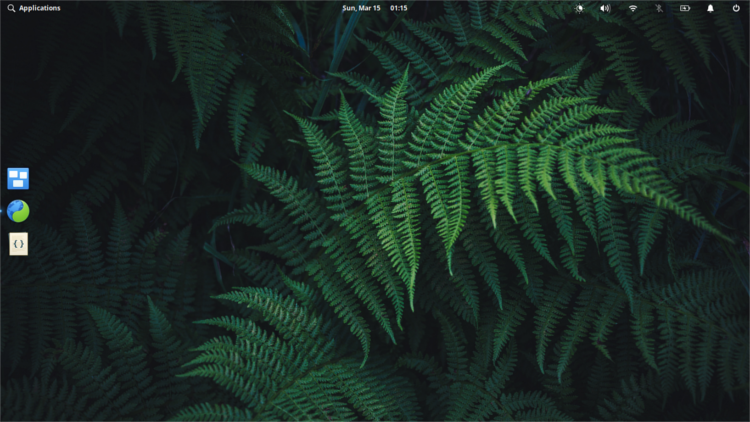

# About Me

Hello 🖐️
My name is Ali Murteza Yesil  
I am studying Computer Sci... Programming. I am interested in Rust Language.  
Night Owl

### I use FOSS
Not only FOSS, but for the most part.
I use Elementary and Manjaro distros on my PC and Lineage OS on my phone.

### I like computers
I was a tinkerer kind since childhood. While my brother was playing Minecraft, I was in look for mods.
Games pulled me to computers, mods pulled me to programming. Even though I never wrote a mod for any game, ability to turn these fancy pile of metals (computers) to something useful attracted me to computer programming.

### Contact Me

For general talk  
[Mastodon](https://mastodon.social) :
    @murteza_y@mastodon.social  
    https://mastodon.social/@murteza_y

For tech related talk  
[Fosstodon](https://fosstodon.org) :
    @murtezayesil@fosstodon.org  
    https://fosstodon.org/@murtezayesil
